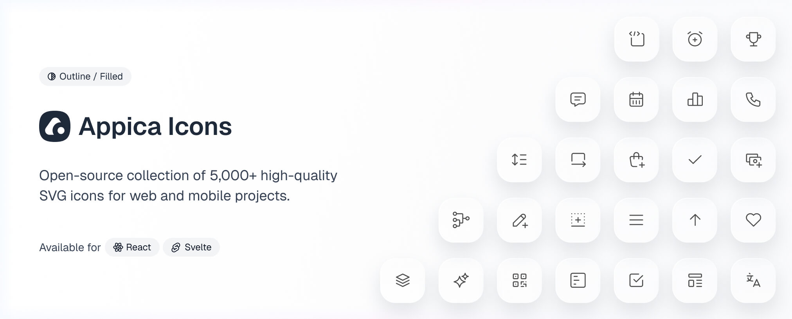

A monorepo housing framework packages for the Appica SVG icon collection.

Icons are sourced primarily from [Tabler Icons](https://tabler.io/icons), with a selection from [Hugeicons](https://hugeicons.com) and some custom designs. All icons are normalized, consistently refined, optimized for smaller file size, and organized into categories.

SVG sources live in [`assets/`](./assets), organized by category — each framework package generates its components from them at build time and is published to npm independently.

## Packages

|                                                                 | Package                | Version                                                                                                         | Links                                                                                                       |
| --------------------------------------------------------------- | ---------------------- | --------------------------------------------------------------------------------------------------------------- | ----------------------------------------------------------------------------------------------------------- |
|    | `@appica/icons-react`  |    | [Docs](https://appica.dev/ui/icons) · [Changelog](packages/react/CHANGELOG.md) · [Source](packages/react)   |
|  | `@appica/icons-svelte` |  | [Docs](https://appica.dev/ui/icons) · [Changelog](packages/svelte/CHANGELOG.md) · [Source](packages/svelte) |

More variants are planned — webfont, Vue and more.

## Figma design file

The full icon collection is included in the free [Appica UI Figma file](https://www.figma.com/community/file/1657080448204231925), alongside the component library it pairs with — use the same icons in your designs that you import in code.

## Stay updated

Follow [@Appica_dev](https://x.com/Appica_dev) on X for release announcements, new icons, and previews of what's coming.

## Contributing

See [CONTRIBUTING.md](CONTRIBUTING.md) for development setup and workflow.

## License

MIT © [Appica](https://appica.dev)

Free to use in personal and commercial projects.
